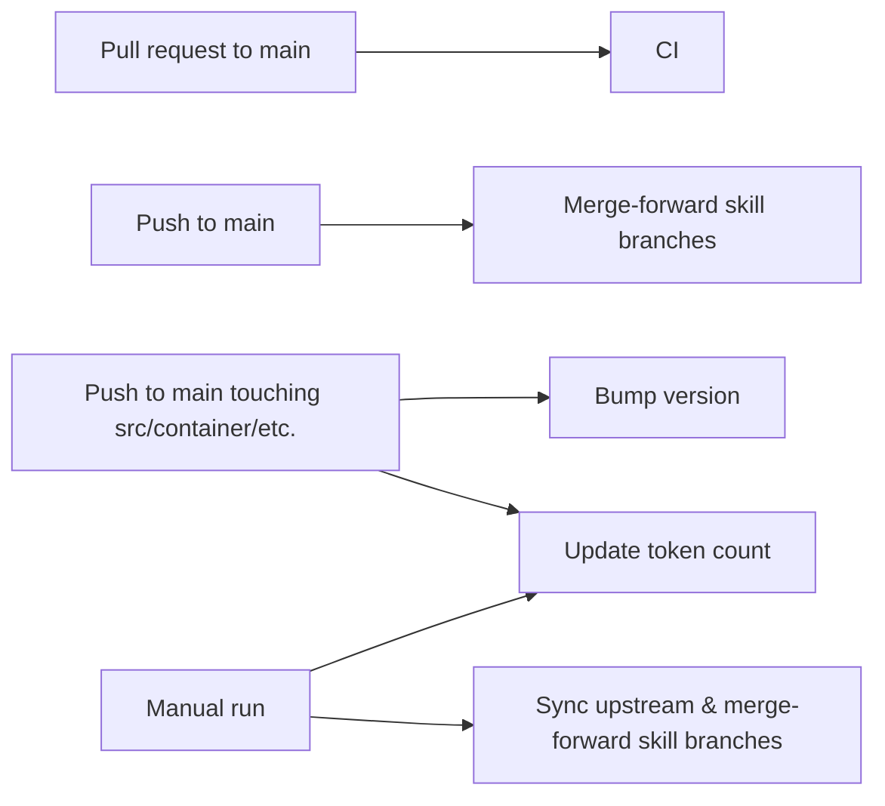

<p align="center">
  
</p>

<p align="center">
  An AI assistant that runs agents securely in their own containers. Lightweight, built to be easily understood and completely customized for your needs.
</p>

<p align="center">
  <a href="https://nanoclaw.dev">nanoclaw.dev</a>&nbsp; • &nbsp;
  <a href="README_zh.md">中文</a>&nbsp; • &nbsp;
  <a href="https://discord.gg/VDdww8qS42"></a>&nbsp; • &nbsp;
  <a href="repo-tokens"></a>
</p>

---

<h2 align="center">🐳 Now Runs in Docker Sandboxes</h2>
<p align="center">Every agent gets its own isolated container inside a micro VM.<br>Hypervisor-level isolation. Millisecond startup. No complex setup.</p>

**macOS (Apple Silicon)**
```bash
curl -fsSL https://nanoclaw.dev/install-docker-sandboxes.sh | bash
```

**Windows (WSL)**
```bash
curl -fsSL https://nanoclaw.dev/install-docker-sandboxes-windows.sh | bash
```

> Currently supported on macOS (Apple Silicon) and Windows (x86). Linux support coming soon.

<p align="center"><a href="https://nanoclaw.dev/blog/nanoclaw-docker-sandboxes">Read the announcement →</a>&nbsp; · &nbsp;<a href="docs/docker-sandboxes.md">Manual setup guide →</a></p>

---

## Why I Built NanoClaw

[OpenClaw](https://github.com/openclaw/openclaw) is an impressive project, but I wouldn't have been able to sleep if I had given complex software I didn't understand full access to my life. OpenClaw has nearly half a million lines of code, 53 config files, and 70+ dependencies. Its security is at the application level (allowlists, pairing codes) rather than true OS-level isolation. Everything runs in one Node process with shared memory.

NanoClaw provides that same core functionality, but in a codebase small enough to understand: one process and a handful of files. Agents run in their own Linux containers with filesystem isolation, not merely behind permission checks.

## Quick Start

```bash
gh repo fork qwibitai/nanoclaw --clone
cd nanoclaw
claude
```

<details>
<summary>Without GitHub CLI</summary>

1. Fork [qwibitai/nanoclaw](https://github.com/qwibitai/nanoclaw) on GitHub (click the Fork button)
2. `git clone https://github.com/<your-username>/nanoclaw.git`
3. `cd nanoclaw`
4. `claude`

</details>

Then run `/setup`. Claude Code handles everything: dependencies, authentication, container setup and service configuration.

> **Note:** Commands prefixed with `/` (like `/setup`, `/add-whatsapp`) are [Claude Code skills](https://code.claude.com/docs/en/skills). Type them inside the `claude` CLI prompt, not in your regular terminal. If you don't have Claude Code installed, get it at [claude.com/product/claude-code](https://claude.com/product/claude-code).

## Philosophy

**Small enough to understand.** One process, a few source files and no microservices. If you want to understand the full NanoClaw codebase, just ask Claude Code to walk you through it.

**Secure by isolation.** Agents run in Linux containers (Apple Container on macOS, or Docker) and they can only see what's explicitly mounted. Bash access is safe because commands run inside the container, not on your host.

**Built for the individual user.** NanoClaw isn't a monolithic framework; it's software that fits each user's exact needs. Instead of becoming bloatware, NanoClaw is designed to be bespoke. You make your own fork and have Claude Code modify it to match your needs.

**Customization = code changes.** No configuration sprawl. Want different behavior? Modify the code. The codebase is small enough that it's safe to make changes.

**AI-native.**
- No installation wizard; your chosen agent CLI guides setup.
- No monitoring dashboard; ask the agent what's happening.
- No debugging tools; describe the problem and the agent fixes it.

**Skills over features.** Instead of adding features (e.g. support for Telegram) to the codebase, contributors submit [claude code skills](https://code.claude.com/docs/en/skills) like `/add-telegram` that transform your fork. You end up with clean code that does exactly what you need.

**Best harness, best model.** NanoClaw keeps Claude support intact and can also run Codex. You choose the agent backend per install, and can override it per registered group if you want different channels to use different models.

## What It Supports

- **Multi-channel messaging** - Talk to your assistant from WhatsApp, Telegram, Discord, Slack, or Gmail. Add channels with skills like `/add-whatsapp` or `/add-telegram`. Run one or many at the same time.
- **Isolated group context** - Each group has its own `CLAUDE.md` memory, isolated filesystem, and runs in its own container sandbox with only that filesystem mounted to it.
- **Main channel** - Your private channel (self-chat) for admin control; every group is completely isolated
- **Scheduled tasks** - Recurring jobs that run the selected agent backend and can message you back
- **Web access** - Search and fetch content from the Web
- **Container isolation** - Agents are sandboxed in [Docker Sandboxes](https://nanoclaw.dev/blog/nanoclaw-docker-sandboxes) (micro VM isolation), Apple Container (macOS), or Docker (macOS/Linux)
- **Agent Swarms** - Spin up teams of specialized agents that collaborate on complex tasks
- **Optional integrations** - Add Gmail (`/add-gmail`) and more via skills

## Usage

Talk to your assistant with the trigger word (default: `@Andy`):

```
@Andy send an overview of the sales pipeline every weekday morning at 9am (has access to my Obsidian vault folder)
@Andy review the git history for the past week each Friday and update the README if there's drift
@Andy every Monday at 8am, compile news on AI developments from Hacker News and TechCrunch and message me a briefing
```

From the main channel (your self-chat), you can manage groups and tasks:
```
@Andy list all scheduled tasks across groups
@Andy pause the Monday briefing task
@Andy join the Family Chat group
```

### Slack / Chat Commands

If your main channel is on Slack, you can say the same things there. Typical task-management commands:

```text
@Andy list all scheduled tasks across groups
@Andy list all scheduled tasks
@Andy pause task task-123
@Andy resume task task-123
@Andy cancel task task-123
@Andy remind me at 10pm to stop working
@Andy every weekday at 9am send me a standup reminder
```

If the main channel is configured with `requiresTrigger: false`, plain messages also work:

```text
list all scheduled tasks
remind me at 10pm to stop working
```

### Viewing Tasks From the Terminal

You can inspect scheduled tasks directly from SQLite:

```bash
sqlite3 -header -column store/messages.db "
  SELECT id, group_jid, schedule_type, schedule_value, status, next_run, prompt
  FROM tasks
  ORDER BY created_at DESC;
"
```

Useful filtered views:

```bash
# Only active tasks
sqlite3 -header -column store/messages.db "
  SELECT id, group_jid, schedule_type, schedule_value, next_run, prompt
  FROM tasks
  WHERE status = 'active'
  ORDER BY next_run ASC;
"
```

```bash
# One task by id
sqlite3 -header -column store/messages.db "
  SELECT *
  FROM tasks
  WHERE id = 'task-123';
"
```

If you want to inspect the whole database as JSON instead of raw SQL rows:

```bash
npm run db:json
```

That writes `store/messages.json`. You can also override input/output paths:

```bash
tsx scripts/export-messages-db.ts store/messages.db /tmp/messages.json
```

## Customizing

NanoClaw doesn't use configuration files. To make changes, just tell Claude Code what you want:

- "Change the trigger word to @Bob"
- "Remember in the future to make responses shorter and more direct"
- "Add a custom greeting when I say good morning"
- "Store conversation summaries weekly"

Or run `/customize` for guided changes.

The codebase is small enough that Claude can safely modify it.

## Contributing

**Don't add features. Add skills.**

If you want to add Telegram support, don't create a PR that adds Telegram to the core codebase. Instead, fork NanoClaw, make the code changes on a branch, and open a PR. We'll create a `skill/telegram` branch from your PR that other users can merge into their fork.

Users then run `/add-telegram` on their fork and get clean code that does exactly what they need, not a bloated system trying to support every use case.

### RFS (Request for Skills)

Skills we'd like to see:

**Communication Channels**
- `/add-signal` - Add Signal as a channel

**Session Management**
- `/clear` - Add a `/clear` command that compacts the conversation (summarizes context while preserving critical information in the same session). Requires figuring out how to trigger compaction programmatically via the Claude Agent SDK.

## GitHub Workflows

NanoClaw currently includes five GitHub Actions workflows in `.github/workflows`:



### CI

File: `.github/workflows/ci.yml`

Trigger:
- Pull requests targeting `main`

What it does:
- Installs dependencies with `npm ci`
- Runs formatting checks
- Runs TypeScript typechecking
- Runs the test suite with Vitest

Use this when:
- You want PR validation before merging into `main`

### Bump version

File: `.github/workflows/bump-version.yml`

Trigger:
- Pushes to `main` that change `src/**` or `container/**`

What it does:
- Creates a GitHub App token
- Bumps the patch version in `package.json`
- Commits the version change
- Pushes the commit back to `main`

Notes:
- Requires `APP_ID` and `APP_PRIVATE_KEY` repository secrets
- Intended for repositories where direct pushes to `main` are allowed for the bot

Use this when:
- You want releases or deployable changes on `main` to automatically advance the patch version

### Update token count

File: `.github/workflows/update-tokens.yml`

Trigger:
- Manual run with `workflow_dispatch`
- Pushes to `main` that change `src/**`, `container/**`, `launchd/**`, or `CLAUDE.md`

What it does:
- Recomputes repository token statistics
- Updates `repo-tokens/badge.svg`
- Commits any resulting changes to `README.md` and the badge

Notes:
- Requires `APP_ID` and `APP_PRIVATE_KEY` repository secrets
- Useful after significant source or prompt-surface changes

Use this when:
- You want the README badge and token counts refreshed immediately without waiting for another qualifying push

### Merge-forward skill branches

File: `.github/workflows/merge-forward-skills.yml`

Trigger:
- Every push to `main`

What it does:
- Runs only in the upstream repository `qwibitai/nanoclaw`
- Merges `main` into every remote `skill/*` branch
- Builds and tests each branch after merge
- Pushes successful merges
- Opens an issue if a skill branch fails due to merge conflicts, build failures, or test failures
- Notifies channel fork repositories that upstream `main` changed

Use this when:
- You are maintaining the upstream repository and want all skill branches kept current with `main`

### Sync upstream & merge-forward skill branches

File: `.github/workflows/fork-sync-skills.yml`

Trigger:
- Manual run with `workflow_dispatch`

What it does:
- Runs only in forks, not in `qwibitai/nanoclaw`
- Fetches `qwibitai/nanoclaw` as `upstream`
- Merges `upstream/main` into the fork's `main`
- Builds and tests the updated `main`
- Pushes the synced `main`
- Then merges the fork's `main` into every `skill/*` branch
- Opens issues if upstream sync or skill branch merge-forward fails

Use this when:
- You maintain a fork and want to pull upstream changes plus propagate them into your fork's skill branches in one action

### How to run the manual workflows

From the GitHub web UI:

1. Open the repository on GitHub.
2. Go to `Actions`.
3. Select either `Update token count` or `Sync upstream & merge-forward skill branches`.
4. Click `Run workflow`.
5. Choose the target branch, usually `main`.

From GitHub CLI:

```bash
gh workflow run update-tokens.yml
gh workflow run fork-sync-skills.yml
```

### Which workflow to use

- Updating a PR and want validation: use `CI`
- Merged code into `main` and want version bumping handled automatically: `Bump version` does it
- Want to refresh the token badge right now: run `Update token count`
- Maintaining the upstream repo and want skill branches advanced automatically: `Merge-forward skill branches`
- Maintaining a fork and want to sync from upstream plus advance skill branches: run `Sync upstream & merge-forward skill branches`

## Requirements

- macOS or Linux
- Node.js 20+
- [Claude Code](https://claude.ai/download)
- [Apple Container](https://github.com/apple/container) (macOS) or [Docker](https://docker.com/products/docker-desktop) (macOS/Linux)

## Architecture

```
Channels --> SQLite --> Polling loop --> Container (Claude SDK or Codex CLI) --> Response
```

Single Node.js process. Channels are added via skills and self-register at startup — the orchestrator connects whichever ones have credentials present. Agents execute in isolated Linux containers with filesystem isolation. Only mounted directories are accessible. Per-group message queue with concurrency control. IPC via filesystem.

## Agent Backends

NanoClaw supports two backends:

- `claude` - the original path, using Claude Code plus the Claude Agent SDK
- `codex` - OpenAI Codex CLI

Set the default backend in `.env`:

```bash
AGENT_PROVIDER=claude
```

or:

```bash
AGENT_PROVIDER=codex
```

Advanced users can also override the backend per group by setting `containerConfig.agentProvider` in the registered group record.

### Claude Usage

1. Set `AGENT_PROVIDER=claude` in `.env`
2. Configure one of:
   - `CLAUDE_CODE_OAUTH_TOKEN=...`
   - `ANTHROPIC_API_KEY=...`
   - `ANTHROPIC_AUTH_TOKEN=...`
3. Start or restart NanoClaw

### Codex Usage

1. Set `AGENT_PROVIDER=codex` in `.env`
2. Pick a Codex auth mode:

API key mode:

```bash
CODEX_AUTH_MODE=openai
OPENAI_API_KEY=...
```

ChatGPT/Codex OAuth mode:

```bash
CODEX_AUTH_MODE=openai-codex
```

In OAuth mode, NanoClaw reuses your host `codex login` state by copying the required OAuth tokens into each group's isolated `.codex/` home, and mirrors session history back into the host `~/.codex` so the Codex app can see those sessions.

If `CODEX_AUTH_MODE` is omitted, NanoClaw auto-detects:
- `openai-codex` when `~/.codex/auth.json` contains a ChatGPT OAuth login
- otherwise `openai`

Advanced users can also override the Codex auth mode per group with `containerConfig.codexAuthMode`.

Examples:

```bash
# Codex with API key
AGENT_PROVIDER=codex
CODEX_AUTH_MODE=openai
OPENAI_API_KEY=...
```

```bash
# Codex with ChatGPT/Codex OAuth
AGENT_PROVIDER=codex
CODEX_AUTH_MODE=openai-codex
```

## Starting NanoClaw

### Enable Startup Persistence (macOS)

Enable NanoClaw as a `launchd` service that starts automatically after login:

```bash
npm run build
launchctl unload ~/Library/LaunchAgents/com.nanoclaw.plist || true
launchctl load ~/Library/LaunchAgents/com.nanoclaw.plist
launchctl kickstart -k gui/$(id -u)/com.nanoclaw
```

Check service status:

```bash
launchctl print gui/$(id -u)/com.nanoclaw | sed -n '1,80p'
```

### Disable Startup Persistence (macOS)

Stop the `launchd` service and disable auto-start:

```bash
launchctl unload ~/Library/LaunchAgents/com.nanoclaw.plist
```

### Start Temporarily (Foreground)

Use this when you want the fastest way to bring NanoClaw up and watch logs directly:

```bash
npm run build
node dist/index.js
```

Stop the foreground process:

```bash
Ctrl+C
```

### Start Temporarily (Background)

If you want it running only for the current session without enabling startup persistence:

```bash
npm run build
nohup node dist/index.js >> ~/Library/Logs/nanoclaw/manual.log 2>> ~/Library/Logs/nanoclaw/manual.error.log < /dev/null &
```

Stop the temporary background process:

```bash
pkill -f 'node dist/index.js'
```

### Development

Use hot reload during local development:

```bash
npm run dev
```

For the full architecture details, see [docs/SPEC.md](docs/SPEC.md).

Key files:
- `src/index.ts` - Orchestrator: state, message loop, agent invocation
- `src/channels/registry.ts` - Channel registry (self-registration at startup)
- `src/ipc.ts` - IPC watcher and task processing
- `src/router.ts` - Message formatting and outbound routing
- `src/group-queue.ts` - Per-group queue with global concurrency limit
- `src/container-runner.ts` - Spawns streaming agent containers
- `src/task-scheduler.ts` - Runs scheduled tasks
- `src/db.ts` - SQLite operations (messages, groups, sessions, state)
- `groups/*/CLAUDE.md` - Per-group memory

## FAQ

**Why Docker?**

Docker provides cross-platform support (macOS, Linux and even Windows via WSL2) and a mature ecosystem. On macOS, you can optionally switch to Apple Container via `/convert-to-apple-container` for a lighter-weight native runtime.

**Can I run this on Linux?**

Yes. Docker is the default runtime and works on both macOS and Linux. Just run `/setup`.

**Is this secure?**

Agents run in containers, not behind application-level permission checks. They can only access explicitly mounted directories. You should still review what you're running, but the codebase is small enough that you actually can. See [docs/SECURITY.md](docs/SECURITY.md) for the full security model.

**Why no configuration files?**

We don't want configuration sprawl. Every user should customize NanoClaw so that the code does exactly what they want, rather than configuring a generic system. If you prefer having config files, you can tell Claude to add them.

**Can I use third-party or open-source models?**

Yes. In Claude mode, NanoClaw supports any Claude API-compatible model endpoint. Set these environment variables in your `.env` file:

```bash
ANTHROPIC_BASE_URL=https://your-api-endpoint.com
ANTHROPIC_AUTH_TOKEN=your-token-here
```

This allows you to use:
- Local models via [Ollama](https://ollama.ai) with an API proxy
- Open-source models hosted on [Together AI](https://together.ai), [Fireworks](https://fireworks.ai), etc.
- Custom model deployments with Anthropic-compatible APIs

Note: The model must support the Anthropic API format for best compatibility.

**How do I debug issues?**

Ask Claude Code. "Why isn't the scheduler running?" "What's in the recent logs?" "Why did this message not get a response?" That's the AI-native approach that underlies NanoClaw.

**Why isn't the setup working for me?**

If you have issues, during setup, Claude will try to dynamically fix them. If that doesn't work, run `claude`, then run `/debug`. If Claude finds an issue that is likely affecting other users, open a PR to modify the setup SKILL.md.

**What changes will be accepted into the codebase?**

Only security fixes, bug fixes, and clear improvements will be accepted to the base configuration. That's all.

Everything else (new capabilities, OS compatibility, hardware support, enhancements) should be contributed as skills.

This keeps the base system minimal and lets every user customize their installation without inheriting features they don't want.

## Community

Questions? Ideas? [Join the Discord](https://discord.gg/VDdww8qS42).

## Changelog

See [CHANGELOG.md](CHANGELOG.md) for breaking changes and migration notes.

## License

MIT
